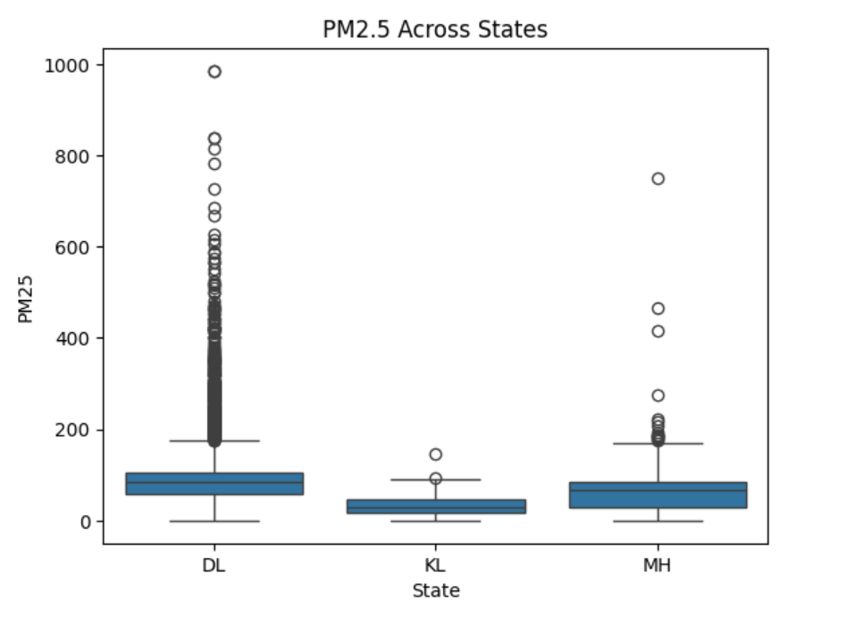
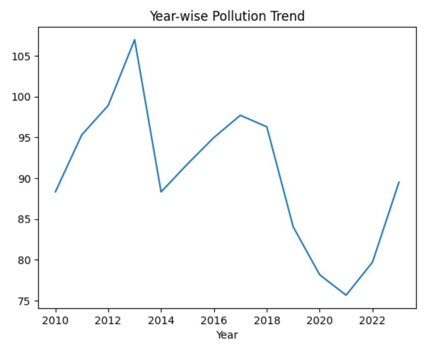
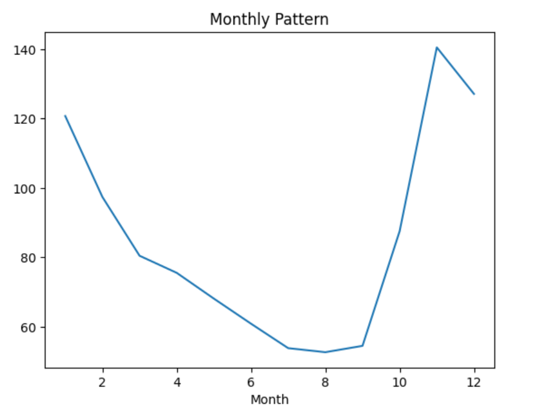
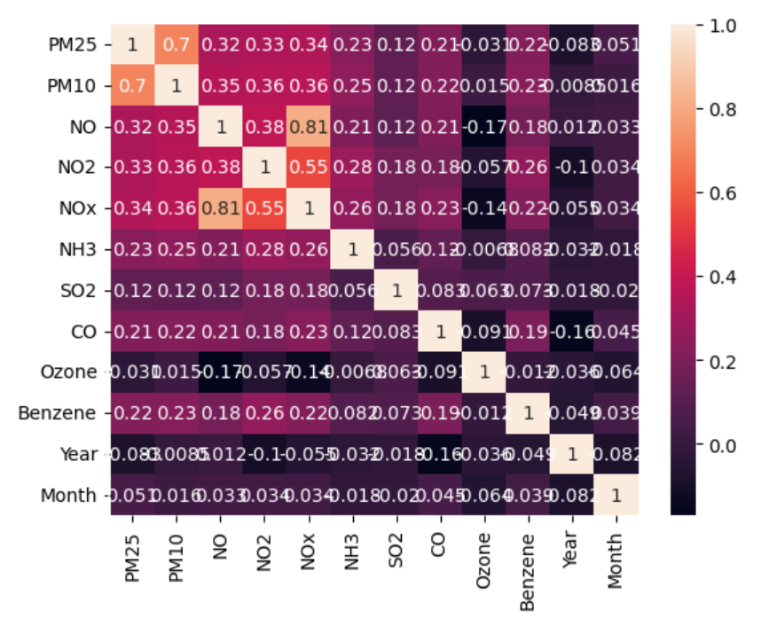
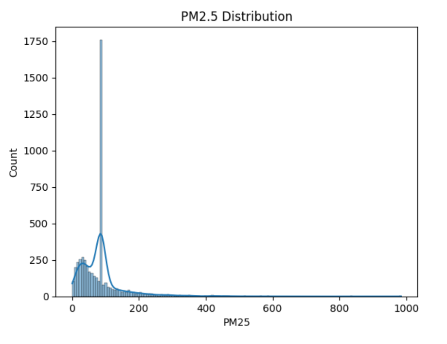
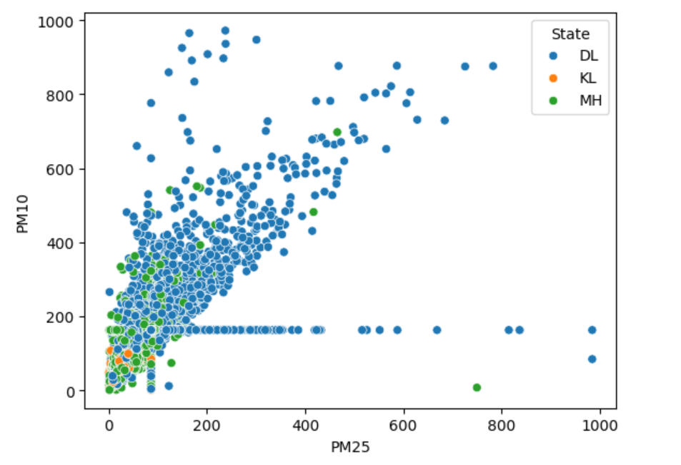

# 🌍 Air Quality Analysis (India)

## 📌 Project Overview
This project performs a comparative time series analysis of air quality across Kerala, Delhi, and Maharashtra from 2010 to 2023 using Python.

## 📊 Objectives
- State-wise air quality comparison  
- Year-wise pollution trend analysis  
- Seasonal (monthly) pattern analysis  
- Correlation between pollutants  
- Outlier detection  

## 🛠️ Tech Stack
- Python  
- Pandas, NumPy  
- Matplotlib, Seaborn  

## 📂 Dataset
- Source: Kaggle (CPCB data)  
- Includes pollutants: PM2.5, PM10, NO2, SO2, CO, etc.  

## 📈 Visualizations

### State-wise Comparison

### Year-wise Trend

### Monthly Pattern

### Correlation Heatmap

### Distribution of PM2.5

### Scatter Analysis

## 🔍 Key Insights
- Delhi shows the highest pollution levels  
- Seasonal spikes occur during winter  
- Strong correlation between PM2.5 and PM10  
- Presence of extreme pollution events (outliers)  

## 🚀 Future Scope
- Real-time data integration  
- Machine learning predictions  
- Interactive dashboards  

## 👤 Author
Thahseen Jafar
